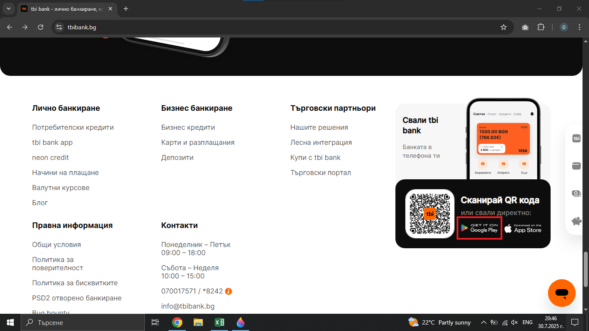
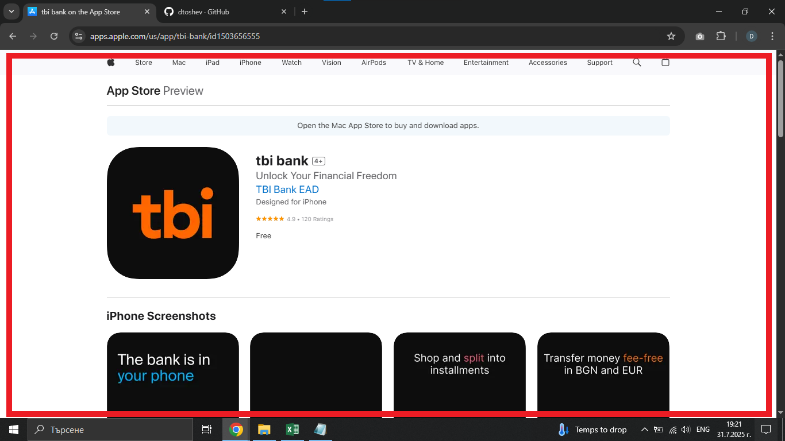

# Bug Report: Тhe Google play app store badge redirects the user incorrectly to the Apple App store

## *ID*: BR-001  
## *Date*: 2025-07-31  
## *Status*: Open  
## *Severity*: Low 
## *Priority*: High  

---

## Description

The Google Play badge redirects the user to the Apple App Store instead of the Google Play Store on the Home page.

---

## Preconditions

- Device with stable connection

---

## Steps to reproduce

1. Open https://tbibank.bg/ 
2. Scroll to the footer on home page
3. Click on the app store badge for Google play
4. Make sure that the Google play badge redirects to Google play store

---

## Expected results

When the customer click on app store badge for Google play, they should be redirected to Google play store. 

---

## Actual results

When the customer clicks on the Google play app store badge, they are incorrectly redirected to the App store.

---

### Screenshot:

---

## Environment

* **OS**: Windows 10  
* **Browser**: Google Chrome 138.0.7204.97 (Official Build) (64-bit)
* **Test environment**: Staging

---

## Additional information

