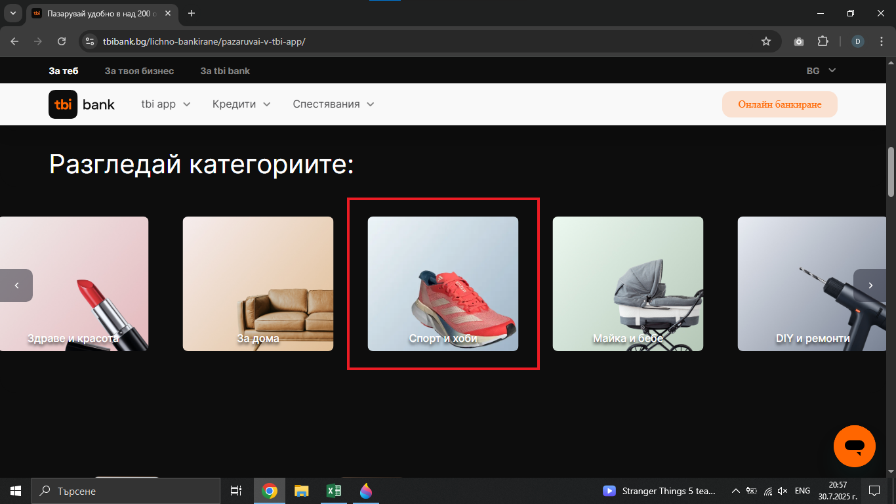
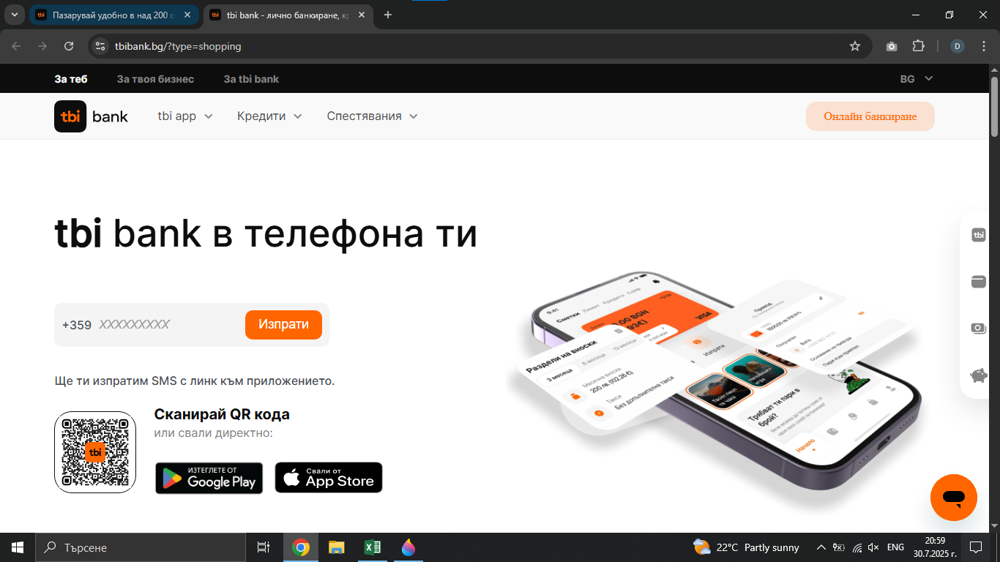

# Bug Report: The "Спорт и хоби" button redirect the user to the wrong page
## *ID*: BR-004  
## *Date*: 2025-07-31  
## *Status*: Open  
## *Severity*: Low
## *Priority*: Medium 

---

## Description

The "Спорт и хоби" button on the "Шопинг секция" page redirect the user to the Home page intead of the list of all sports shop that are partners of TBI Bank.

---

## Preconditions

- Already loaded "Шопинг секция" - https://tbibank.bg/lichno-bankirane/pazaruvai-v-tbi-app/

---

## Steps to reproduce

1. Scroll down to the carousel in "Шопинг секция" page 
2. Click on "Спорт и хоби" button

---

## Expected results

When the customer clicks on the "Спорт и хоби" button, they should be redirected to the list of sport shops that are partners of TBI Bank.

---

## Actual results

When the customer clicks on the "Спорт и хоби" button, they are redirected to the Home page.

---

### Screenshot:

---

## Environment

* **OS**: Windows 10  
* **Browser**: Google Chrome 138.0.7204.97 (Official Build) (64-bit)
* **Test environment**: Staging

---

## Additional information

