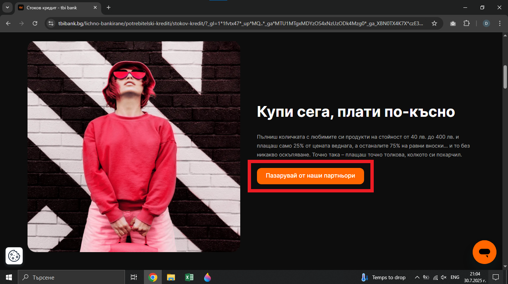
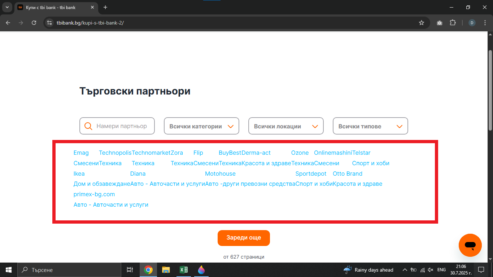

# Bug Report: The "Пазарувай от наши партньори" button on the "Стоков кредит" product page redirects the user to the wrong page
## *ID*: BR-006  
## *Date*: 2025-07-31  
## *Status*: Open  
## *Severity*: Low
## *Priority*: Medium 

---

## Description

The user is redirected to the wrong url when clicking the "Пазарувай от наши партньори" button on the "Стоков кредит" product page

---

## Preconditions

- Already loaded "Стоков кредит" - https://tbibank.bg/lichno-bankirane/potrebitelski-krediti/stokov-kredit/

---

## Steps to reproduce

1. Scroll down to the section titled "Купи сега, плати по-късно"
2. Click on the "Пазарувай от наши партньори" button

---

## Expected results

When the customer clicks on the "Пазарувай от наши партньори" button, they should be redirected to the "Търговски партньори" page, which contains a list of business partners, including their names and icons, associated with TBI Bank with url - https://tbibank.bg/merchant-search/

---

## Actual results

When the customer clicks on the "Пазарувай от наши партньори" button, they are redirected to the page with name "Търговски партньори" with url - https://tbibank.bg/kupi-s-tbi-bank-2/

---

### Screenshot:

---

## Environment

* **OS**: Windows 10  
* **Browser**: Google Chrome 138.0.7204.97 (Official Build) (64-bit)
* **Test environment**: Staging

---

## Additional information
