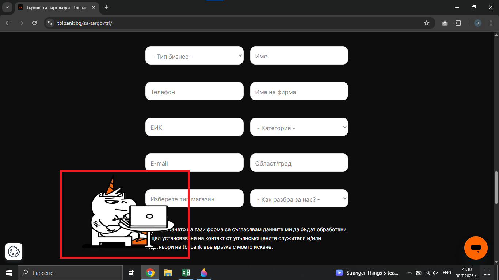

# Bug Report: The logo on the "Стани наш партньор" page overlaps part of the text in the form
## *ID*: BR-008  
## *Date*: 2025-07-31  
## *Status*: Open  
## *Severity*: Low
## *Priority*: High

---

## Description

Part of the text in form on the page "Стани наш партньор" is overlapped by the logo and hiding important information about the personal data.

---

## Preconditions

- Already loaded "Стани наш партньор" page - https://tbibank.bg/za-targovtsi/

---

## Steps to reproduce

1. Scroll down to the form for partners titled "Попълни данните си в контактната форма"
2. Check the position of the logo in the form

---

## Expected results

All text labels and form elements should be fully visible and not overlapped by any logo.

---

## Actual results

The user filling out the form cannot see the message informing them that, by submitting the form, they agree to provide their personal data so the bank can contact them.

---

### Screenshot:

---

## Environment

* **OS**: Windows 10  
* **Browser**: Google Chrome 138.0.7204.97 (Official Build) (64-bit)
* **Test environment**: Staging

---

## Additional information
