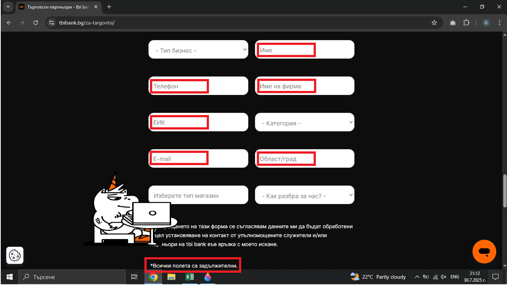

# Bug Report: The required fields in the form on the "Стани наш партньор" page aren't marked with an asterisk
## *ID*: BR-009  
## *Date*: 2025-07-31  
## *Status*: Open  
## *Severity*: Low
## *Priority*: Medium 

---

## Description

The fields in the form on the "Стани наш партньор" page aren't marked with an asterisk and the user can't easily understand which fields are actually required.

---

## Preconditions

- Already loaded "Стани наш партньор" page - https://tbibank.bg/za-targovtsi/

---

## Steps to reproduce

1. Scroll down to the form for partners titled "Попълни данните си в контактната форма"
2. Check that each field in front of the label name contains "*"

---

## Expected results

When the customer start to filling out the form, they should see all fields marked with an asterisk "*" in front of the label.

---

## Actual results

The required fields in the form aren't marked with an asterisk ("*") in front of the label.

---

### Screenshot:

---

## Environment

* **OS**: Windows 10  
* **Browser**: Google Chrome 138.0.7204.97 (Official Build) (64-bit)
* **Test environment**: Staging

---

## Additional information
