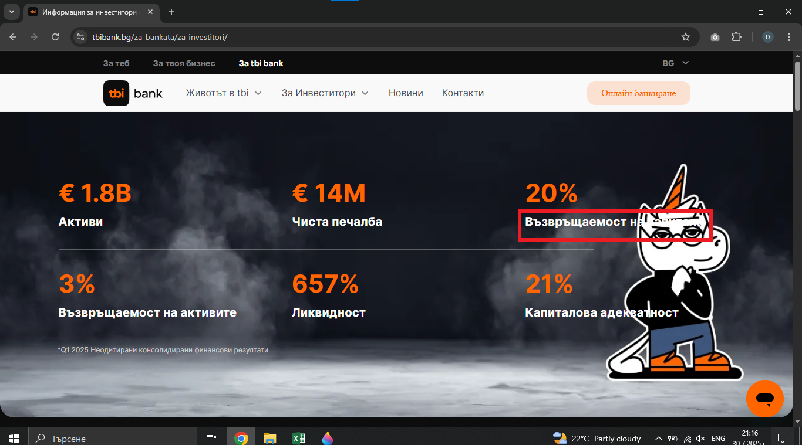

# Bug Report: Text label merges with background color, making it unreadable
## *ID*: BR-010  
## *Date*: 2025-07-31  
## *Status*: Open  
## *Severity*: Low
## *Priority*: Low

---

## Description

On the "BG" page the user can't see the entire text on the label because the background color merges with the font color.

---

## Preconditions

- Already loaded "Контакти" page - https://tbibank.bg/kontakti/

---

## Steps to reproduce

1. Put the cursor over "За Инвеститори" button from navigation bar in page
2. From drop-down menu click on the "BG" button 

---

## Expected results

When the customer opens the "BG" page with information for investors, all text on the page should be clearly readable.

---

## Actual results

When the customer opens the "BG" page with information for investors, the "Възвръщаемост на капитала" label isn't readable to the customer.

---

### Screenshot:

---

## Environment

* **OS**: Windows 10  
* **Browser**: Google Chrome 138.0.7204.97 (Official Build) (64-bit)
* **Test environment**: Staging

---

## Additional information
