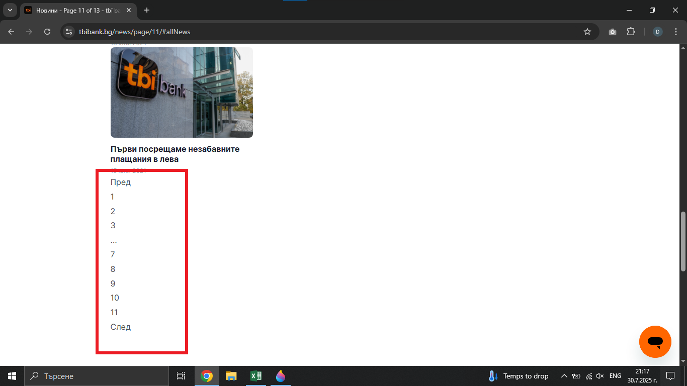

# Bug Report: The design of the pagination on the "Новини" page changes unexpectedly
## *ID*: BR-011
## *Date*: 2025-07-31  
## *Status*: Open  
## *Severity*: Low
## *Priority*: Medium 

---

## Description

When the user is on the "Новини" page and select the last page from news (number 11), the design of the pagination changes unexpectedly.

---

## Preconditions

- Already loaded "Контакти" page - https://tbibank.bg/kontakti/

---

## Steps to reproduce

1. Click on "Новини" button from navigation bar in page
2. Scroll down to the pagination area on the news page
3. Click on "11" number button from pagination

---

## Expected results

When the customer clicks on the "11" button in the pagination, they should see page 11 with news and the design of the pagination should remain consistent with the previuous pages.

---

## Actual results

When the customer clicks on the "11" button in the pagination, they see page 11 with news and the design of the pagination is different than before.

---

### Screenshot:

---

## Environment

* **OS**: Windows 10  
* **Browser**: Google Chrome 138.0.7204.97 (Official Build) (64-bit)
* **Test environment**: Staging

---

## Additional information
