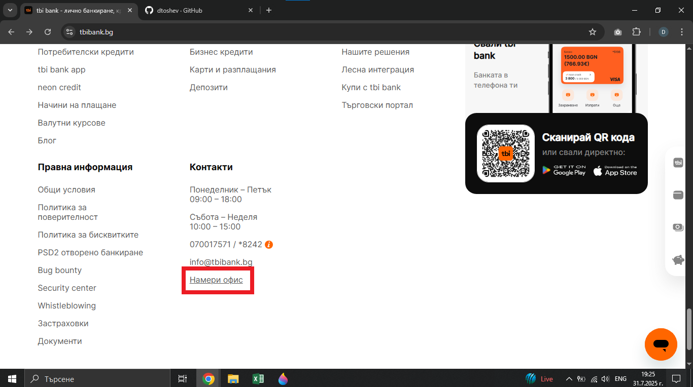
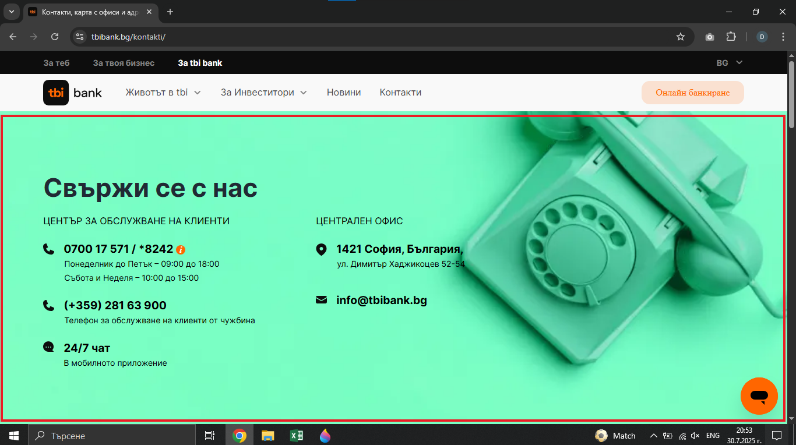

# Bug Report: The "Намери офис" anchor link in footer on the home page redirects to the wrong section of the page. 

## *ID*: BR-002  
## *Date*: 2025-07-31  
## *Status*: Open  
## *Severity*: 
## *Priority*:  

---

## Description

The "Намери офис" link should scroll to the office locator section, but it scrolls to a different part of the page.

---

## Preconditions

- Device with stable connection

---

## Steps to reproduce

1. Open https://tbibank.bg/ 
2. Scroll to the footer on home page
3. Click on "Намери офис" anchor link 

---

## Expected results

When the customer clicks on anchor link in footer in home page, they should be redirected to another page that displays the part of the page with the map of the offices.

---

## Actual results

When the customer clicks on anchor link in footer in home page, they are redirected to another page that displays part of the page with contacts instead of the map of the offices.

---

### Screenshot:

---

## Environment

* **OS**: Windows 10  
* **Browser**: Google Chrome 138.0.7204.97 (Official Build) (64-bit)
* **Test environment**: Staging

---

## Additional information

