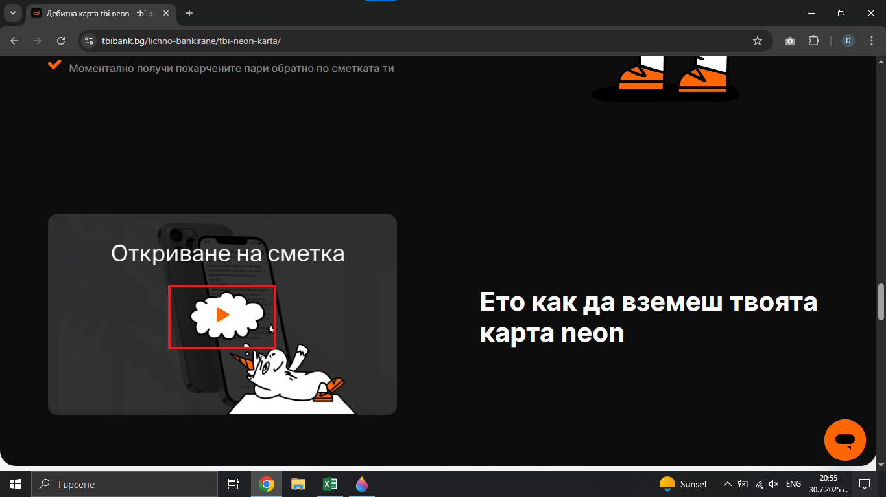
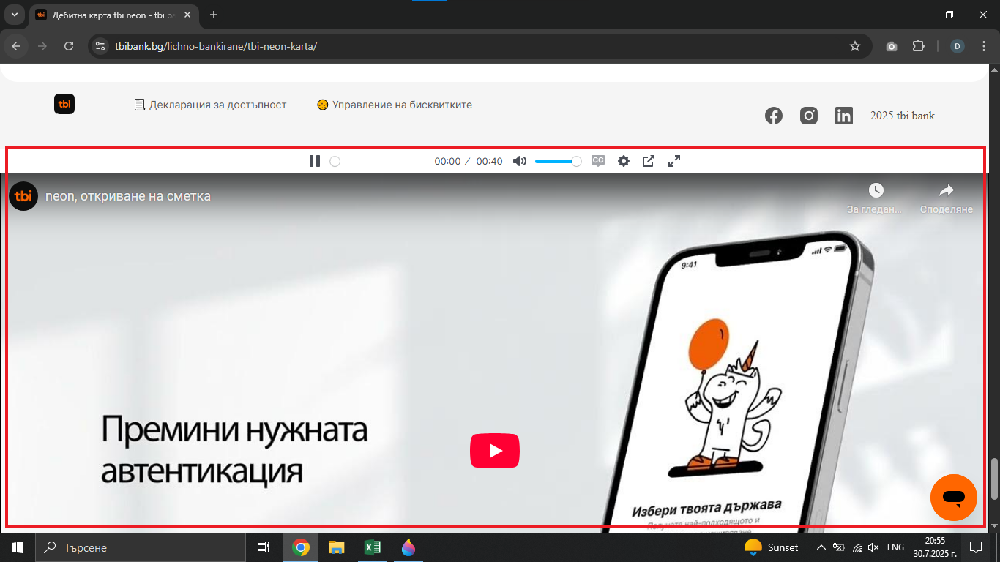

# Bug Report: Modal video popup doesn't open correctly on the "neon" page
## *ID*: BR-003  
## *Date*: 2025-07-31  
## *Status*: Open  
## *Severity*: Low
## *Priority*: Medium 

---

## Description

The YouTube video on the "neon" page opens at the bottom of the page instead in a modal window, and the user isn't able to play the video.

---

## Preconditions

- Device with stable connection

---

## Steps to reproduce

1. Open https://tbibank.bg/ 
2. Put the cursor on "tbi app" in navigation bar in home page
3. Click on the "neon" button in the drop-down menu
4. Scroll to the modal video popup 
5. Click on play icon

---

## Expected results

When the customer clicks the play button on the modal video popup window, a Youtube video should open in the popup window and be playable.

---

## Actual results

When the customer clicks the play button on the modal video popup, the video appears at the bottom of the page and can't be played.

---

### Screenshot:

---

## Environment

* **OS**: Windows 10  
* **Browser**: Google Chrome 138.0.7204.97 (Official Build) (64-bit)
* **Test environment**: Staging

---

## Additional information

