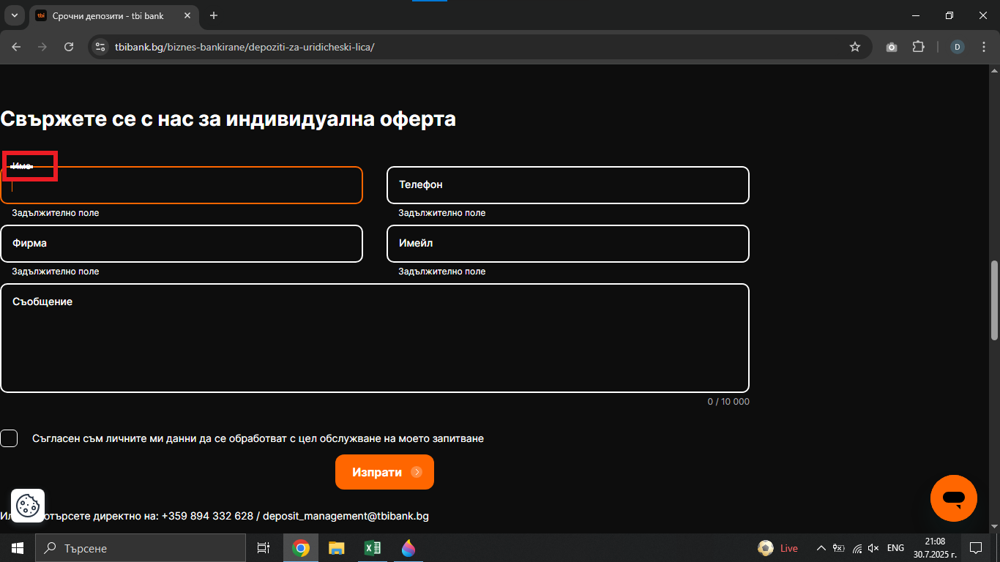
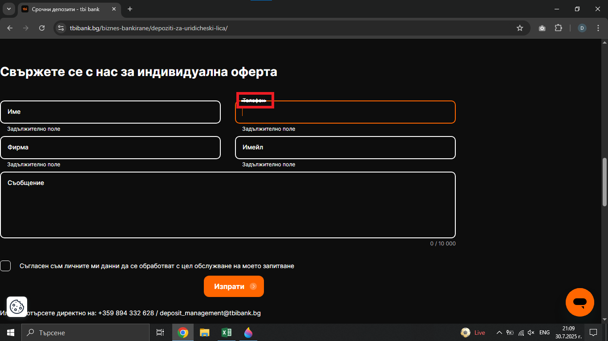

# Bug Report: The Floating Labels in the individual offer form on the "Срочни депозити" page aren't visible to the customer
## *ID*: BR-007  
## *Date*: 2025-07-31  
## *Status*: Open  
## *Severity*: Low
## *Priority*: Low

---

## Description

In the individual offer form on the "Срочни депозити" page, the floating labels become unreadable to the customer when they click on the input fields.

---

## Preconditions

- Already loaded "Срочни депозити" page - https://tbibank.bg/biznes-bankirane/depoziti-za-uridicheski-lica/

---

## Steps to reproduce

1. Scroll down to the contact form for individual offer titled "Свържете се с нас за индивидуална оферта";
2. Click with cursor in each one fields - "Име", "Телефон", "Фирма", "Имейл" and "Съобщение"

---

## Expected results

When the customer clicks on any of the fields in the form, the label should move above the field, and the field name should remain visible to the customer.

---

## Actual results

When the customer clicks on each of the fields in the form, the labels move above the fields, but their names aren't visible to the customer.

---

### Screenshot:

---

## Environment

* **OS**: Windows 10  
* **Browser**: Google Chrome 138.0.7204.97 (Official Build) (64-bit)
* **Test environment**: Staging

---

## Additional information
